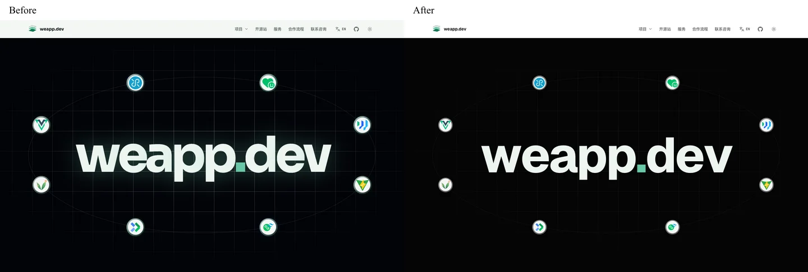
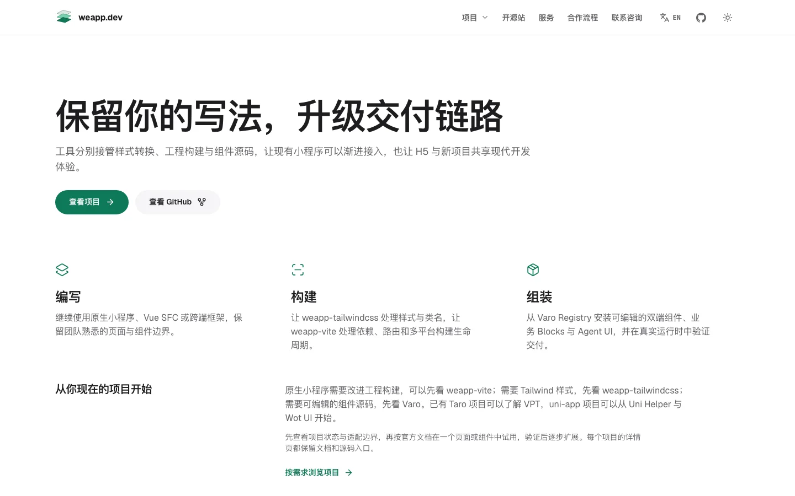
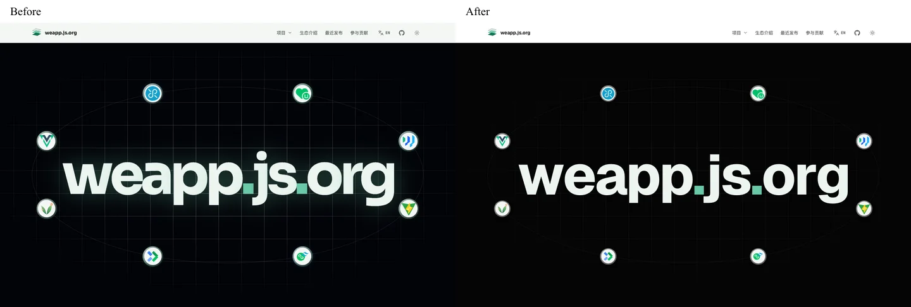
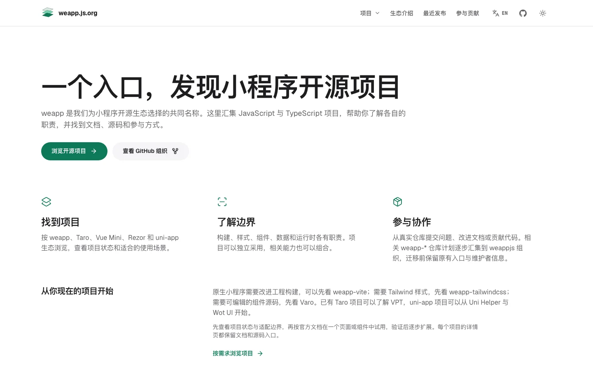

# 双站产品官网设计验收（2026-10-02）

## 本轮结果

在已拆分的两个应用上更新视觉系统。共享中性颜色、Geist 字体、按钮与展示样式；页面编排、SEO、统计和商业模块仍由各应用维护。保持现有深色默认值和已保存的主题偏好。

| 项目     | 改造前                           | 改造后                                                  |
| -------- | -------------------------------- | ------------------------------------------------------- |
| 背景     | 带绿倾向的深浅底色               | 中性白/浅灰与黑/深灰                                    |
| 标题字体 | Sora                             | 自托管 Geist，中文系统字体                              |
| 控件     | 小圆角、强调边框                 | 44px 以上触控目标、圆形主按钮、安静次操作               |
| 章节     | 较密的标题与分隔线               | 36–64px 章节标题，宽松留白与宽幅真实演示                |
| 粒子     | 聚合后持续 requestAnimationFrame | 700ms 停留 +1500ms 聚合，随后最多10次/秒，离屏/后台暂停 |
| 项目目录 | 父组件样式未正确作用于子组件     | 样式由项目卡片拥有，桌面行布局/手机堆叠与筛选隐藏可验证 |

## 视觉证据

以下图片来自本地实际构建。首屏对比使用减少动态效果模式，正常粒子模式另有截图和绘制调用回归；图片是评审证据，不作为站点素材发布。

### 商业站

### 开源站

完整本地截图在 `.impeccable/review/`，覆盖两站首页 320/390/1280/1440px，以及项目目录、weapp-vite 详情、隐私与商业报价/赞助页 390/1440px。中英文、浅深主题、菜单、统计偏好、404、页脚和图表均已检查。`capture.json` 中所有主矩阵记录均无横向溢出。无 JavaScript 和减少动态效果由 E2E 覆盖。

独立设计复审最初要求清理旧 404 插画和重复小标题，集中修正后判定 **ship**，两项修正均为 resolved；正常粒子补充截图也已确认。本次通过通用子代理承载 finish reviewer/documenter 工作流，工具未提供技能专用代理类型。自动设计检测返回空列表。

## 工程检查

- `pnpm install --frozen-lockfile`、`pnpm check`、`pnpm build` 和 `git diff --check` 通过。
- 138 项单元/边界测试通过；两应用与共享 UI 的类型检查无错误、警告或提示。
- 完整桌面/移动 E2E：商业站 **354 passed /30 skipped**，开源站 **322 passed /30 skipped**。跳过条件沿用设备专属矩阵、非本站功能和需单独启用的真实线上统计协议测试。
- 复审修正后定向重跑目录、筛选、语言与404、赞助相关测试：商业站 **174 passed**，开源站 **102 passed**。
- 远端完整回归随后发现4项404旧插画断言未随视觉修正更新；现改为验证实际品牌资源、可读错误说明与同语种返回首页，保留资源失败检测。根路径和Pages子路径的完整专项复验 **10 passed**，lint通过。
- 新增绘制调用测试验证聚合后限频、离屏零绘制及返回恢复；默认可见内容和项目卡片作用域/实际筛选有独立回归。
- 分别在只含单一应用、共享包与根配置的临时目录执行构建（复用安装好的第三方依赖）。两站资源准备、Astro、OG、发现资源、Pages 路径重写及最终产物验证通过，无须另一应用源码。
- 开源 HTML、JS、发现资源及资产清单扫描通过；仍支持根路径与 `/weapp.dev/` 子路径和六个 noindex 历史静态跳转。商业价格、赞助权益、60/25/15、服务边界与 JSON-LD 保持既有事实。

## 体积与运行开销

| 产物             |      基线 |      本轮 |     变化 |
| ---------------- | --------: | --------: | -------: |
| 两站共用首屏脚本 |  13,793 B |  14,008 B |   +215 B |
| 首屏脚本 gzip    |   5,424 B |   5,505 B |    +81 B |
| 商业站全部 CSS   | 119,311 B | 111,529 B | −7,782 B |
| 开源站全部 CSS   | 107,572 B | 104,425 B | −3,147 B |

新增调度器带来81字节 gzip 增量，未引入动画依赖。Sora 依赖与字体请求已删除；本地首次首页只请求 Geist Latin 和 Geist Mono Latin，合计52,528字节字体。商业图表仍按需加载，首页没有加载 ECharts。

本地1440px Chromium正常动画采样中，两站聚合后各在2.1秒内绘制18次，观测 CLS 均为0。基线代码为持续 requestAnimationFrame；未记录改造前同设备LCP/CLS，因此不宣称生产性能提升比例。本地无节流观测不能代替真实用户网络和上线后的统计。

## 交付边界

更新 PR #12，不合并、不部署生产。预览为本地构建；真实域名、线上 SEO/资源/统计请求验收留待发布阶段。继续按[维护手册](maintenance.md)分别保留发布产物并独立回滚。
