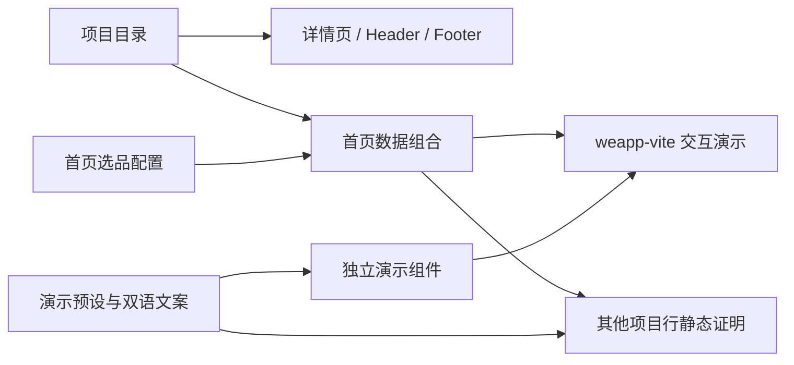

# 首页代码边界

首页按章节组合，交互演示按产品能力独立维护。并行任务应约定章节和组件所有权；结构拆分不能替代对产品方向冲突的人工判断。

## 职责与数据流

- `HomePage.astro` 只组合章节和读取首页数据；`home.css` 负责章节布局和响应式断点。
- 两站共用 Hero → About → weapp 项目（含 weapp-vite 交互演示）→ Taro → Vue Mini / Rezor / uni-app → Toolchain map → Releases → Collaboration。weapp.dev 在 Toolchain map 与 Releases 之间保留 BuildRail、Commercial 与 Vision，以工程交付、迁移、培训和开源资金用途为入口；weapp.js.org 不渲染这三个章节。
- 第一屏只保留 profile 词标（weapp.dev 为 `weapp.dev`，weapp.js.org 为 `weapp`） 与同等权重的项目徽标星座；项目入口和交互演示放在第一屏之后，不进入首屏文案。星座不按轨道远近分等级，weapp-sqlite 与 Rezor 不进星座。
- 首页项目按 `ecosystem` 分区：weapp 原生四件套、Taro（VPT）、Vue Mini、Rezor、uni-app（Uni Helper / Wot UI）。不用精选三图或编号排名。
- `HomeVision` 用「负责 / 不负责」边界卡替代抽象原则文案，避免证明区之后情绪低谷。
- `content/home-projects.ts` 显式指定项目顺序、演示类型、反向布局和双语阶段标签。新增目录项目不会自动进入首页。
- `lib/home-projects.ts` 是纯组装器，只关联目录与首页选品，校验未知项目和重复选品。首页不再要求 showcase 图片。
- `components/home/demos/` 的 Style、Build、Registry 分别拥有视图、局部状态及预设；`HomeDemo` 只按受限类型选择组件。
- `HomeDemos` 只拥有标签选择和键盘导航；**交互演示出现在 weapp-vite 项目行**。其余项目行使用 `HomeProjectProof` 展示更尖的静态产物（默认写法 / 构建命令 / 接入命令），避免重复演同一套 labs。
- 项目行 CTA 只保留主入口「阅读文档」与次入口「项目详情」；标题不再外链，避免同一意图多扇门。
- `CodePanel` 共享代码显示、复制与错误反馈；代码通过结构化文本片段生成，客户端使用 DOM textContent，避免 HTML 注入。
- `demo.css` 只负责演示内部布局、容器断点与操作后的颜色过渡；`copy.ts` 维护演示双语文案。不要把演示状态或样式放进全局脚本。
- 项目 JSON 继续拥有状态、链接、metrics 输入和详情页 `primary/secondary` 图片。历史 showcase collection、图片和采集命令保留，首页不再读取它们。



## 双站数据边界

`src/lib/deployment.ts` 的 `getSiteProfile()` 在构建时选择目标，提供站名、hero 词标、规范域名、输出目录、导航、组织与源码入口及功能开关。`WEAPP_DEPLOY_TARGET=weapp` 输出 `dist`，`github-pages` 输出 `dist-pages`。两份产物共享九个项目的真实状态、文档域名和源码地址；不得为开源站重写项目成熟度或暗示文档已迁移。

weapp.js.org 的 Header 导航为项目、生态介绍、最近发布和参与贡献。Footer、项目目录、详情、隐私、404、SEO 和发现资源沿用开源身份，不出现服务、赞助、资金、基金或通向 weapp.dev 的商业入口。旧 pricing/sponsors/contributors 中英六页由独立静态跳转页承接，同语种跳到 projects，保留 noindex、meta refresh 和可见相对链接，并排除出 sitemap。

## 演示来源与行为

- Tailwind 示例由本仓库已有 weapp-tailwindcss Vite 插件生成 Web CSS。有限类名写成完整字面量，`@source '../**/*.{astro,ts}'` 能扫描全部状态。预览类名和展示代码来自同一状态函数。
- weapp-vite 配置摘自 [multi-platform 文档](https://github.com/weapp-vite/weapp-vite/blob/add5d6c7f31e74e9fa2290e43891548f2a00eccc/website/guide/multi-platform.md)。展示单目标 allowlist、CLI 参数、原生扩展名，以及该文档多平台模板的输出目录。目录并非所有自定义工程的默认值；保留模板和 experimental 标注。
- Varo 命令摘自 [README](https://github.com/daguanren21/Varo/blob/d00ea30fdd2caf84ce383c05291517f2e6af1861/README.md)，采用当前 `@varo-ui/cli add --target weapp`。详情页历史元数据在本次首页变更范围之外。原生 HTML 组合是带标注的交互示意，不加载 Vue/Varo runtime，不执行 CLI，不调用 AI。
- 无 JS 时服务器输出完整默认代码与结果，增强控件隐藏；事件绑定完成后启用控件。Registry 的文本输入保留原生可编辑能力，组件选择至少保留一项。
- 动效只响应用户操作，不自动轮播；减少动态效果时立即更新。演示不挂载 reveal，其他章节继续使用全局 2.5 秒超时兜底。
- `@theme inline static` 必须保留，防止独立 CSS 引用的字体变量被 Tailwind 裁掉。

## 维护与验证

演示变更只修改对应视图、预设和测试；资料变更只修改项目 JSON。截图生成器不得改写演示选品或产品资料。不要用 Git ours/theirs 策略掩盖语义冲突。

单测覆盖目录扩展与排序、元数据与展示配置独立性、预设到代码和命令的一致性。两份产物分别运行桌面和移动 E2E，任一失败都阻止部署。Pages 还用同一产物在 `/weapp.dev/` 下验收资源、语言和无 JS 跳转。E2E 覆盖真实计算样式、平台输出、组件选择边界、实例隔离、标签键盘操作、剪贴板错误和无 JS 降级，并保留 SEO、analytics、主题、reveal 与详情页图片检查。

```bash
rtk pnpm --filter @weapp.dev/web check
rtk pnpm --filter @weapp.dev/web test
rtk pnpm --filter @weapp.dev/web build
rtk pnpm --filter @weapp.dev/web test:e2e
rtk pnpm --filter @weapp.dev/web build:pages
WEAPP_DEPLOY_TARGET=github-pages rtk pnpm --filter @weapp.dev/web exec playwright test
rtk pnpm --filter @weapp.dev/web lint
rtk pnpm --filter @weapp.dev/web lint:styles
rtk pnpm --filter @weapp.dev/web media:verify-home
```

视觉检查输出到 `apps/web/.cache/demo-qa/`，包含双语首页、三个标签与操作状态、详情页和 Pricing 的桌面/移动端浅深主题。前后对比读取 `.cache/showcase-qa/` 中的历史截图；旧 `media:verify-showcase` 命令作为新验证入口的别名保留。素材采集和截图验证都是显式维护命令，正常构建不依赖外部仓库或开发者工具。
